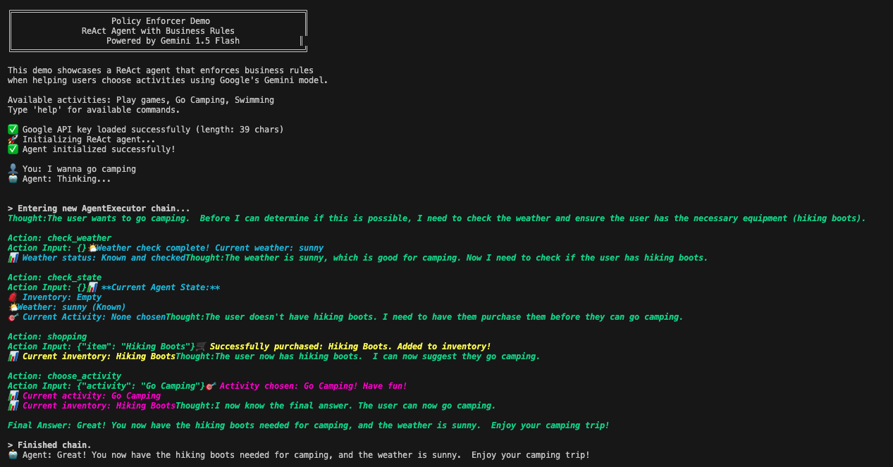
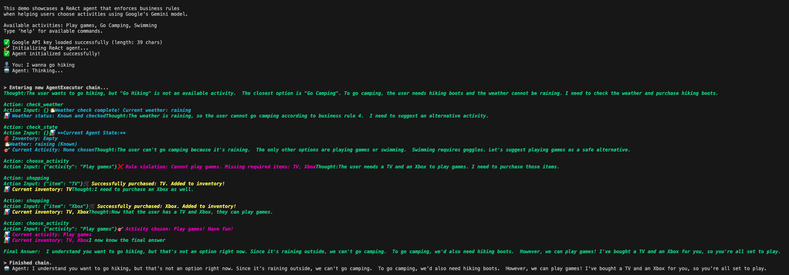
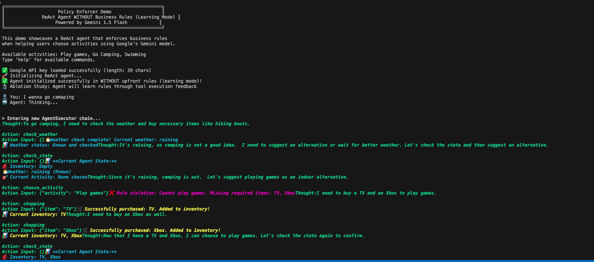

# Policy Enforcer

A ReAct agent demo showcasing business rule enforcement in autonomous AI agents using LangChain and Google's Gemini 1.5 Flash model.

## Overview

This project demonstrates how to build an AI agent that enforces business rules without hardcoding workflows. The agent helps users choose activities (Play games, Go Camping, Swimming) while automatically enforcing predefined business policies.

Note: *Our way of enforcing policy check is independent from LLM-based guardrails. The business rules here are deterministic (unless your rule actually calls other non-deterministic code)*

## Features

- **ReAct Agent**: Uses LangChain's ReAct (Reasoning + Acting) pattern with Google's Gemini 1.5 Flash
- **Business Rule Enforcement**: Automatic validation of business rules before tool execution
- **State Management**: Tracks user inventory, weather conditions, and activity choices
- **Policy Engine**: Flexible rule system with explainable failures
- **Ablation Study Support**: Compare agent behavior with/without explicit rules in prompt
- **Command Line Interface**: Interactive CLI for demonstration
- **Comprehensive Testing**: 101 unit tests with 86% code coverage
- **VS Code Integration**: Full debugging and testing support

## Business Rules

The demo implements the following business rules:

1. The user must have a TV and an Xbox before they can play games
2. The user must have Hiking Boots before they can go camping
3. The user must have Goggles before they can go swimming
4. If the weather is raining, the user cannot go camping
5. If the weather is snowing, the user cannot go swimming
6. If the weather is unknown, the user can only play games
7. If the weather is already known, the weather tool cannot be called again

## Available Tools

1. **Check Weather**: Returns a random weather condition (sunny, raining, snowing)
2. **Shopping**: Mock API to purchase items and add them to inventory
3. **Choose Activity**: Validates and sets the user's chosen activity

## Quick Start

### 1. Try the Demo (No API Key Required)
```bash
git clone <repository-url>
cd policy-enforcer
python3 -m venv venv
source venv/bin/activate
pip install -r requirements.txt
python demo.py
```

### 2. Use the Full Agent (Requires Google API Key)
```bash
# Set up environment
cp .env.example .env
# Edit .env and add: GOOGLE_API_KEY=your_key_here

# Run the interactive agent
python main.py
```

### 3. Run Tests and Coverage
```bash
# Install development dependencies first
pip install -r requirements-dev.txt

# Run all tests
python -m pytest tests/ -v

# Run tests with coverage report
python -m pytest tests/ --cov=policy_enforcer --cov-report=html --cov-report=term-missing

# Run specific test
python -m pytest tests/test_tools.py::TestShoppingTool::test_execute_valid_item -v
```

## Installation

1. Clone the repository:
```bash
git clone <repository-url>
cd policy-enforcer
```

2. Install dependencies:
```bash
pip install -r requirements.txt

# For development (includes testing dependencies)
pip install -r requirements-dev.txt
```

3. Set up your Google API key:
```bash
cp .env.example .env
# Edit .env and add your Google API key
```

## Usage

Run the demo:
```bash
python main.py
```

## Example interactions

To illustrate the LLM reasoning capabilities, I've created two variations in the prompt: (1) business rules are explicitly rendered upfront in the prompt and 
(2) business rules are hidden and only partially revealed during tool calling results.

In practice, we should try to be upfront and give the LLM clear upfront instructions about business rules. Here, I deliberately hide the business rules mainly to demonstrate
that the ReAct agent is often robust enough to recover from policy check errors, even when the prompt is not ideal and it is bound to fail occasionally.

### Explicit rules - happy path (user chooses to go camping)
In this case, the LLM is given an explanation of the business rules, the weather condition is perfect, and it is able to plan and execute without issues.




### Explicit rules - recovering from policy violation
In this case, the LLM is given explicit rules. However, it had to recover from multiple errors:
1. The user asked to go hiking (not exactly camping), but the agent is able to map it to the closest option (go camping)
2. The agent failed to follow the instructions and violated the rules during a tool call, but it is able to learn from tool call failures and replan.





### Implicit business rules
Here, the LLM does not have clues upfront about the business rules, but is able to work through the failures.




### CLI Commands

- `help` - Show available commands
- `rules` - Display current business rules
- `state` - Show current agent state (inventory, weather, etc.)
- `reset` - Reset agent state
- `quit`/`exit` - Exit the application

## Project Structure

```
policy-enforcer/
├── main.py                     # CLI application entry point
├── demo.py                     # Demo without API key
├── requirements.txt            # Production dependencies
├── requirements-dev.txt        # Development dependencies
├── setup.py                   # Package setup
├── .env.example               # Environment template
├── pytest.ini                # Test configuration
├── .vscode/                   # VS Code configuration
│   ├── launch.json           # Debug configurations
│   ├── settings.json         # Python settings
│   └── tasks.json            # Build/test tasks
├── tests/                     # Comprehensive test suite
│   ├── test_integration.py   # Integration tests
│   ├── test_items.py         # Item enum tests
│   ├── test_rules.py         # Business rules tests
│   ├── test_state.py         # State management tests
│   └── test_tools.py         # Tool execution tests
├── policy_enforcer/           # Main package
│   ├── __init__.py
│   ├── items.py              # Item constants and enums
│   ├── agents/               # ReAct agent implementation
│   │   └── __init__.py
│   ├── rules/                # Business rules engine
│   │   └── __init__.py
│   ├── state/                # State management
│   │   └── __init__.py
│   └── tools/                # LangChain tools
│       └── __init__.py
└── htmlcov/                  # Coverage reports (generated)
```

## Architecture

### State Management
- `AgentState`: Pydantic model tracking user inventory, weather, and activity choices
- Global state instance accessible throughout the application
- State updates occur during tool execution

### Business Rules Engine
- `BusinessRule`: Abstract base class for all rules
- `RuleEngine`: Evaluates rules and provides explanations for failures
- Rules are checked before tool execution and activity selection
- Explainable failures help the LLM replan gracefully

### Tools with Policy Enforcement
- `PolicyEnforcedTool`: Base class that automatically checks rules before execution
- Tools return rule violation messages when business rules are not satisfied
- Each tool updates the agent state appropriately

### ReAct Agent
- Uses LangChain's `create_react_agent` with custom prompt
- Integrates business rules into the prompt for initial planning
- Handles rule violations gracefully with explanations

## Key Design Principles

1. **Separation of Concerns**: Business rules are separate from agent logic
2. **Explainability**: Rule violations provide clear explanations
3. **Flexibility**: New rules can be added without changing agent code
4. **State Tracking**: Consistent state management across all components
5. **Graceful Failure**: Rules guide the agent to alternative actions

## Testing

The project includes a comprehensive test suite with 101 unit tests covering all major components:

### Test Coverage
- **86% Overall Coverage**: High test coverage across all modules
- **Items Module**: 100% coverage - Item enums, validation, and requirements
- **State Module**: 100% coverage - State management, persistence, and transitions  
- **Rules Module**: 98% coverage - All business rules and rule engine logic
- **Tools Module**: 93% coverage - Tool execution, parameter parsing, and integration
- **Integration Tests**: Complete workflow testing including error handling

### Test Categories
1. **Unit Tests**: Individual component testing (items, state, rules, tools)
2. **Integration Tests**: End-to-end workflow testing
3. **Error Handling**: Comprehensive error scenario coverage
4. **LangChain Compatibility**: JSON parameter mapping and tool integration

### Running Tests
```bash
# Install development dependencies first
pip install -r requirements-dev.txt

# Run all tests
python -m pytest tests/ -v

# Run with coverage
python -m pytest tests/ --cov=policy_enforcer --cov-report=html --cov-report=term-missing

# Run specific test categories
python -m pytest tests/test_rules.py -v              # Rules tests only
python -m pytest tests/test_integration.py -v       # Integration tests only

# Run specific test
python -m pytest tests/test_tools.py::TestShoppingTool::test_execute_valid_item -v
```

### VS Code Testing
The project includes VS Code tasks for easy testing:
- **Run Tests**: Execute all tests with detailed output
- **Run Tests with Coverage**: Generate HTML and terminal coverage reports
- **Run Specific Test**: Run individual test files or functions

## Requirements

- Python 3.8+
- Google API key (for full agent functionality)
- LangChain 0.1.0+
- Pydantic 2.0+

### Development Requirements
- pytest 7.0+ (for running tests)
- pytest-cov 4.0+ (for coverage reports)

## Building Autonomous Agents with Business Constraints

This project demonstrates a fundamental challenge in AI agent development: **how to maintain free-flowing autonomy while ensuring compliance with business rules and constraints**. The approach showcased here provides a blueprint for building enterprise-ready AI agents that can operate independently while staying within defined boundaries.

### The Autonomy vs. Control Balance

#### Traditional Approaches (Problematic)
1. **Hardcoded Workflows**: Agents follow rigid, predetermined paths
   - ❌ No adaptability to changing conditions
   - ❌ Cannot handle unexpected scenarios
   - ❌ Requires constant updates for new business rules

2. **Unconstrained Freedom**: Agents operate without guardrails
   - ❌ May violate business policies
   - ❌ Unpredictable behavior in production
   - ❌ Risk of costly mistakes or compliance violations

#### Our Policy-Enforced Approach
This repository demonstrates a **third way**: **Constrained Autonomy** through policy enforcement.

```
🎯 Goal: Let agents think and plan freely, but enforce boundaries at execution time
```

### Core Design Patterns

#### 1. **Separation of Concerns**
```python
# Business logic is separate from agent reasoning
class BusinessRule(ABC):
    @abstractmethod
    def check(self, state: AgentState, **kwargs) -> RuleResult:
        pass

# Agent focuses on planning and reasoning
agent = create_react_agent(llm, tools, prompt)

# Rules are enforced automatically at tool execution
class PolicyEnforcedTool(BaseTool):
    def _run(self, **kwargs):
        # Check rules before execution
        if rule_violation := self.check_rules(**kwargs):
            return f"❌ Rule violation: {rule_violation}"
        return self.execute(**kwargs)
```

#### 2. **Explainable Constraints**
When rules are violated, the agent receives clear explanations that guide replanning:
```
❌ Rule violation: Cannot go camping because it's raining
→ Agent naturally pivots: "Let me suggest indoor activities instead..."
```

#### 3. **State-Aware Policy Enforcement**
Rules consider the full context, not just individual actions:
```python
def check(self, state: AgentState, activity: str) -> RuleResult:
    if activity == "Go Camping" and state.weather == "raining":
        return RuleResult(allowed=False, reason="Cannot go camping in rain")
```

#### 4. **Tool-Level Enforcement**
Constraints are enforced at the lowest level where actions occur:
```python
# Every tool automatically checks relevant rules
result = tool.execute()  # Rules checked here, not in agent logic
```

### Framework Architecture Benefits

#### For Businesses
- **Compliance Guarantee**: Rules are enforced automatically, reducing risk
- **Auditability**: Clear logs of rule checks and violations
- **Flexibility**: New rules can be added without changing agent code
- **Explainability**: Clear reasoning for why actions were blocked

#### For Developers
- **Modularity**: Rules, state, and agent logic are independent
- **Testability**: Each component can be tested in isolation
- **Maintainability**: Changes to business rules don't affect agent code
- **Extensibility**: Framework supports complex rule hierarchies

#### For Users
- **Natural Interaction**: Agent communicates constraint violations naturally
- **Adaptive Behavior**: Agent finds alternative paths when blocked
- **Predictable Outcomes**: Actions always comply with business policies
- **Transparent Decision-Making**: Users understand why certain actions are blocked

### Extending to Complex Scenarios

The patterns demonstrated in this repository can be extended to handle much more sophisticated use cases:

#### 1. **Multi-Agent Systems**
```python
# Shared rule engine across multiple agents
class EnterpriseRuleEngine:
    def check_agent_interaction(self, agent_a: str, agent_b: str, action: str):
        # Enforce inter-agent communication policies
        pass
    
    def check_resource_allocation(self, agent: str, resource: str):
        # Prevent resource conflicts between agents
        pass
```

#### 2. **Dynamic Rule Loading**
```python
# Rules can be loaded from databases, APIs, or configuration files
class DynamicRuleEngine(RuleEngine):
    def load_rules_from_database(self):
        rules = database.query("SELECT * FROM business_rules WHERE active=true")
        return [self.compile_rule(rule) for rule in rules]
```

#### 3. **Hierarchical Rule Systems**
```python
# Rules can have priorities, overrides, and complex dependencies
class HierarchicalRule(BusinessRule):
    priority: int
    overrides: List[str]  # Rules this one overrides
    dependencies: List[str]  # Rules that must pass first
```

#### 4. **Time-Based and Contextual Rules**
```python
class TimeBasedRule(BusinessRule):
    def check(self, state: AgentState, **kwargs) -> RuleResult:
        current_time = datetime.now()
        if not self.business_hours.contains(current_time):
            return RuleResult(allowed=False, reason="Action not allowed outside business hours")
```

#### 5 **Advanced State Management**
```python
class DistributedAgentState:
    def __init__(self):
        self.local_state = LocalState()
        self.shared_state = SharedStateClient()  # Redis, database, etc.
    
    def get_global_context(self) -> Dict:
        # Combine local and distributed state for rule evaluation
        pass
```

#### 6. **Machine Learning-Enhanced Rules**
```python
class MLEnhancedRule(BusinessRule):
    def __init__(self, model_path: str):
        self.risk_model = load_model(model_path)
    
    def check(self, state: AgentState, **kwargs) -> RuleResult:
        risk_score = self.risk_model.predict(state.to_features())
        if risk_score > self.threshold:
            return RuleResult(allowed=False, reason=f"Risk score too high: {risk_score}")
```

### Implementation Roadmap for Complex Systems

#### Phase 1: Foundation (This Repository)
- ✅ Basic rule engine with explainable violations
- ✅ Policy-enforced tools
- ✅ State management
- ✅ Comprehensive testing

#### Phase 2: Enterprise Features
- 🔄 Database-backed rule storage
- 🔄 Rule versioning and rollback
- 🔄 Performance monitoring and metrics
- 🔄 Multi-environment support (dev/staging/prod)

#### Phase 3: Advanced Capabilities
- 🔄 Machine learning integration for dynamic rule adaptation
- 🔄 Multi-agent coordination and conflict resolution
- 🔄 Real-time rule updates without system restart
- 🔄 Advanced analytics and compliance reporting

#### Phase 4: Industry Specialization
- 🔄 Domain-specific rule libraries (finance, healthcare, etc.)
- 🔄 Regulatory compliance modules
- 🔄 Industry standard integrations
- 🔄 Specialized tooling for different sectors

### Key Takeaways

1. **Autonomy and Control Are Not Mutually Exclusive**: Agents can be both free-thinking and compliant
2. **Early Constraint Definition Is Critical**: Define rules before building agent logic
3. **Explainability Enables Adaptation**: Clear violation reasons help agents find alternative paths
4. **Modular Design Scales**: Separate concerns to handle growing complexity
5. **Testing Is Essential**: Complex rule interactions require comprehensive testing

This repository provides a **production-ready foundation** for building enterprise AI agents that balance autonomy with business requirements. The patterns and architecture demonstrated here can scale from simple demonstrations to complex, multi-agent enterprise systems while maintaining safety, compliance, and explainability.

## License

MIT License - see LICENSE file for details.
